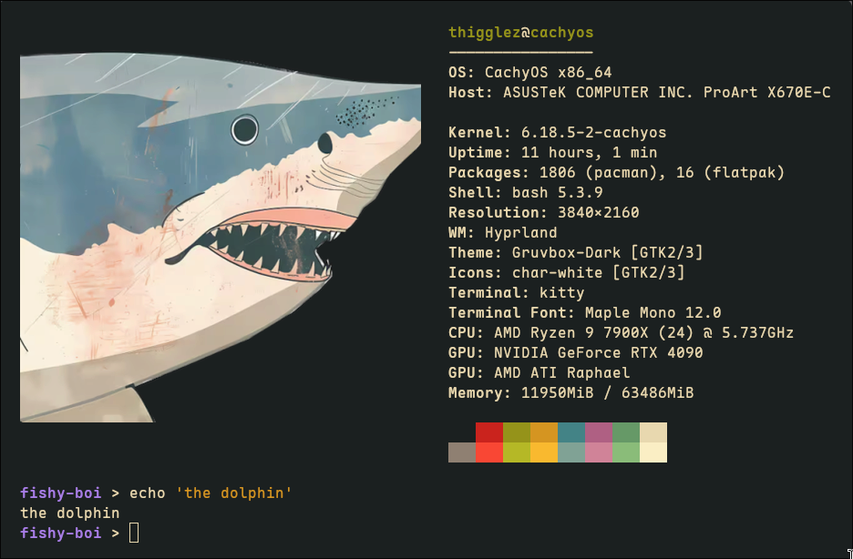

# thigglez_hyprland_desktop
Custom Hyprland config on CachyOS with a themed Waybar and Wofi setup.

Personal Hyprland + Waybar configuration with custom media widgets, drawer groups, and a themed Wofi launcher.

## Preview

Full desktop: overall layout, pill system, and muted pastel bar theme.

Waybar overview: active workspaces, media, and system status at a glance.

App picker: Wofi launcher with the custom prompt styling and theming.

Audio drawer: quick access to output, volume slider, mute, and mic controls.

System drawer: power/metrics tray with CPU, memory, temperature, and toggles.

Terminal: Kitty paired with Fish shell prompt styling and matching theme.

## What's inside
- Waybar config and styling (uniform pill system + themed bar)
- Custom scripts (Spotify metadata/art, toggles, system metrics)
- Drawer groups (audio, metrics, capture)
- Recording + screenshot widgets (wf-recorder + grim/slurp)
- Wofi launcher prompt styling
- Eww popup widgets for calendar + media

## Requirements
- Waybar
- Hyprland (for popup positioning; optional if using static Eww geometry)
- Wofi
- playerctl (for Spotify metadata)
- A Nerd Font or Font Awesome for icons
- wf-recorder (screen recording)
- grim (screenshots)
- slurp (region selection)
- ImageMagick (optional tonemapping for HDR screenshots)
- Eww (calendar + media popups)
- python3 (popup positioning + media metadata)
- kitty + khal or calcurse (optional for calendar)
- libnotify (for missing-calendar notifications)

## Setup
1) Copy this repo into `~/.config/waybar`
2) Ensure scripts are executable:
   ```bash
   chmod +x ~/.config/waybar/scripts/*.sh ~/.config/waybar/scripts/*.py
   ```
3) Eww popups (calendar/media):
   - Copy or symlink `~/.config/waybar/eww` to `~/.config/eww`
   - Ensure Eww scripts are executable:
     ```bash
     chmod +x ~/.config/eww/scripts/*.sh ~/.config/eww/scripts/*.py
     ```
   - Start Eww daemon:
     ```bash
     eww daemon
     ```
   - Calibrate popup edges (move cursor to desired edge before each command):
     ```bash
     ~/.config/eww/scripts/set_popup_edge.py media_popup left primary
     ~/.config/eww/scripts/set_popup_edge.py calendar_popup right primary
     ```
4) Restart Waybar

## KDE Wayland notes
- The popup positioning script uses `hyprctl` when available for cursor + monitor data. On KDE Wayland (no `hyprctl`), the popups will open using the static geometry in `eww.yuck` (top-left offsets).
- If you want precise alignment on KDE, adjust the `:geometry` values in `eww.yuck` or replace the cursor/monitor backend in `eww/scripts/open_popup_at_cursor.py`.

## Notes
- Launcher icon uses `kirby-apps.png` in the repo.
- Spotify widget relies on `playerctl` and writes album art to `~/.cache/waybar/spotify-art`.
- Screen recordings are saved to `~/Videos/recordings/`.
- Screenshots are saved to `~/Pictures/Screenshots/`.
- Eww popup positions are stored in `~/.config/eww/popup_positions.json`.

## License
Personal config; no warranty. Use at your own risk.
